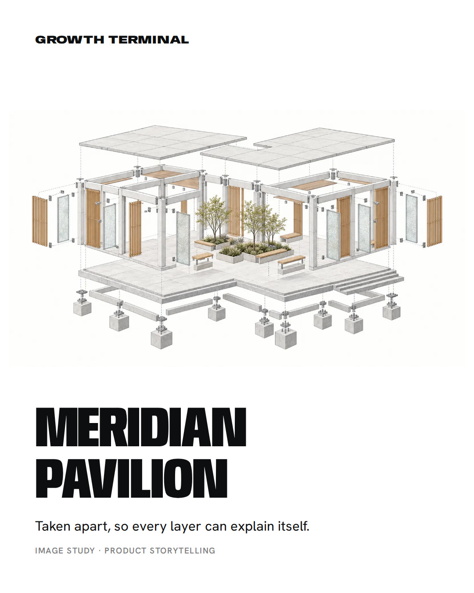
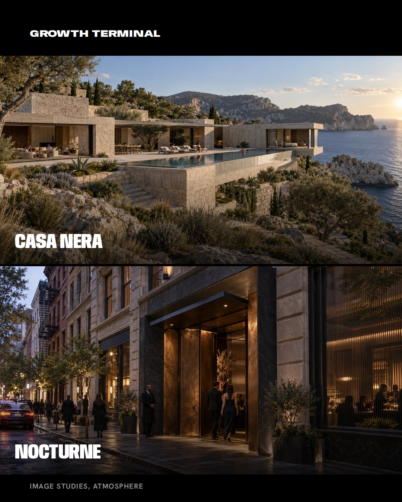
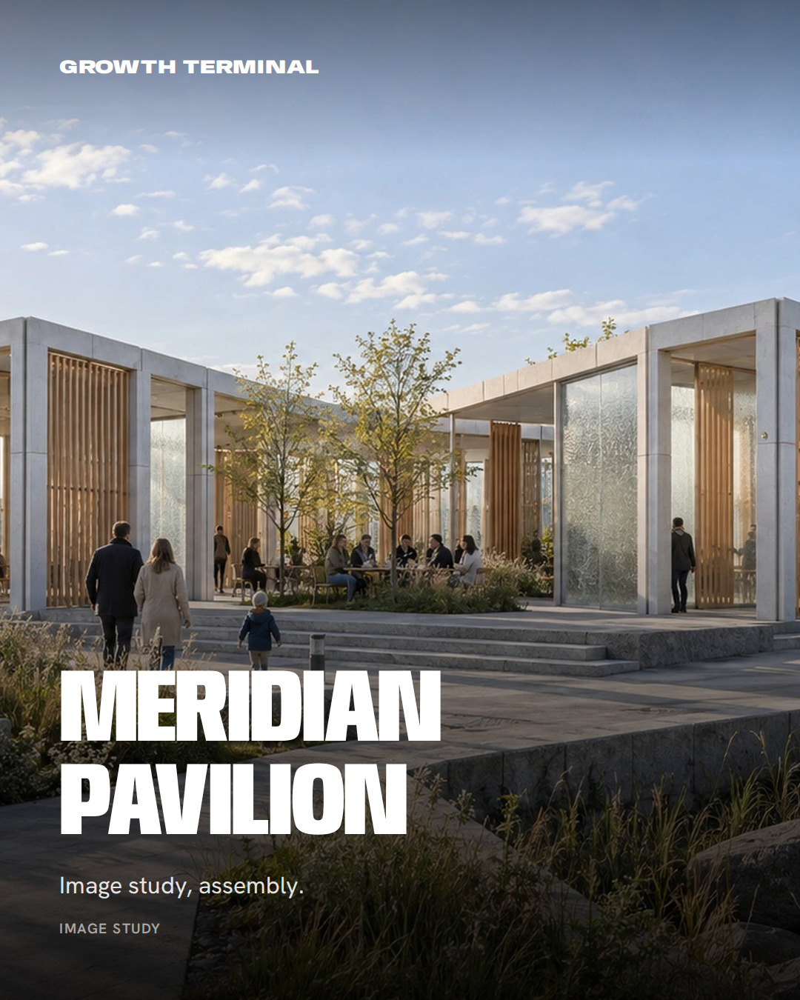
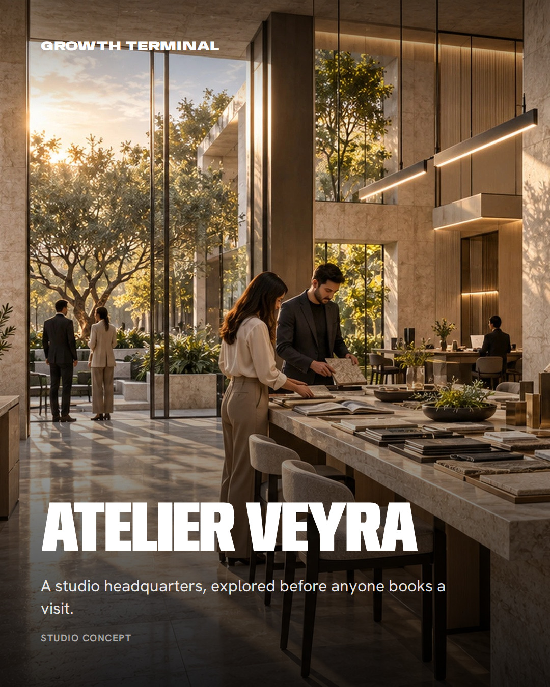
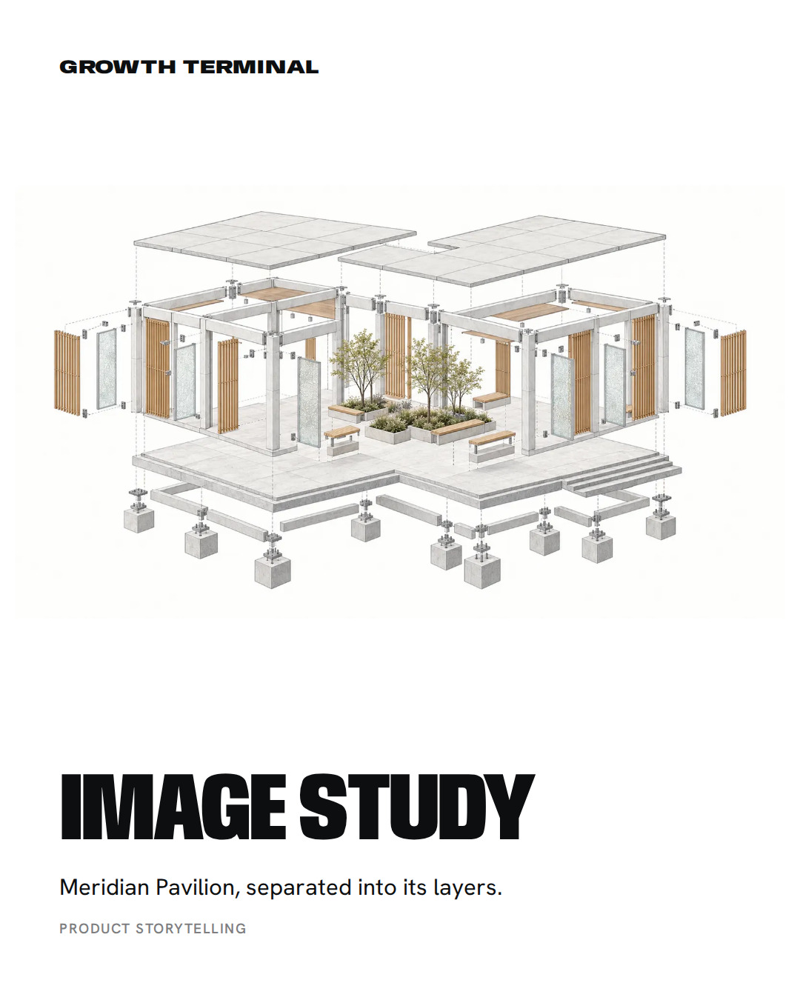
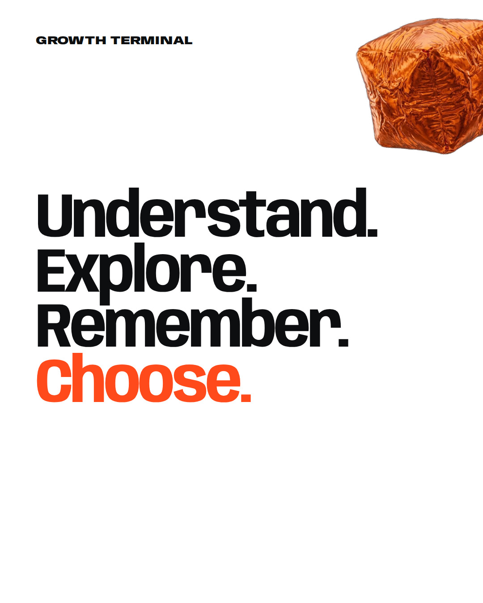
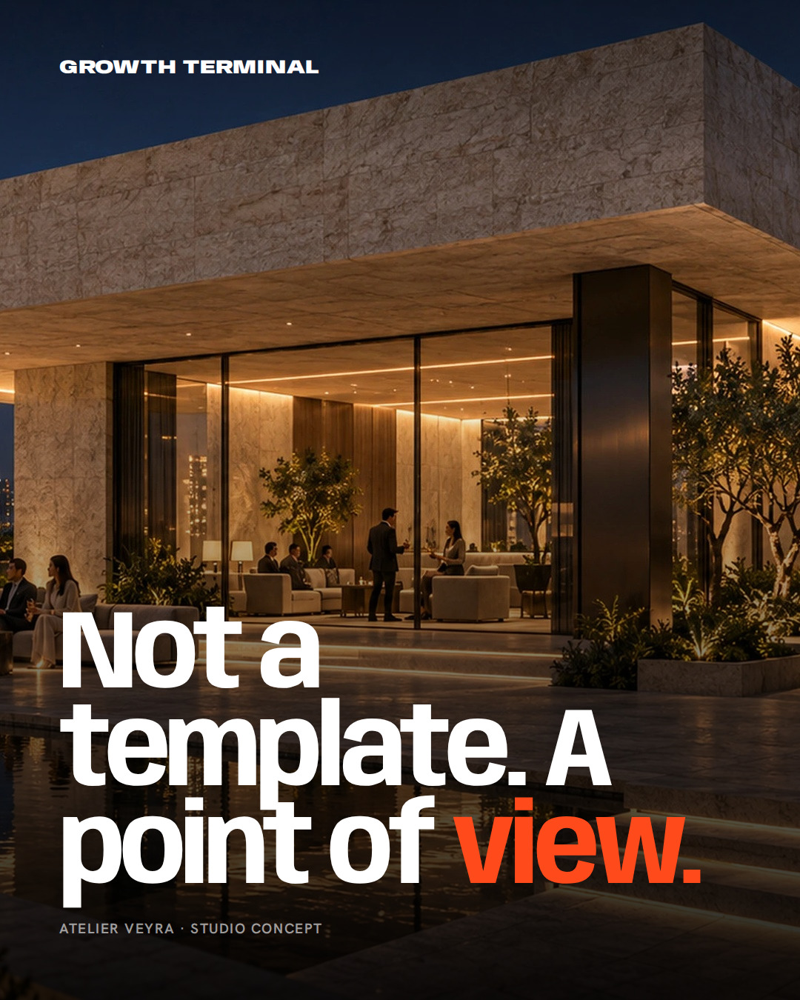
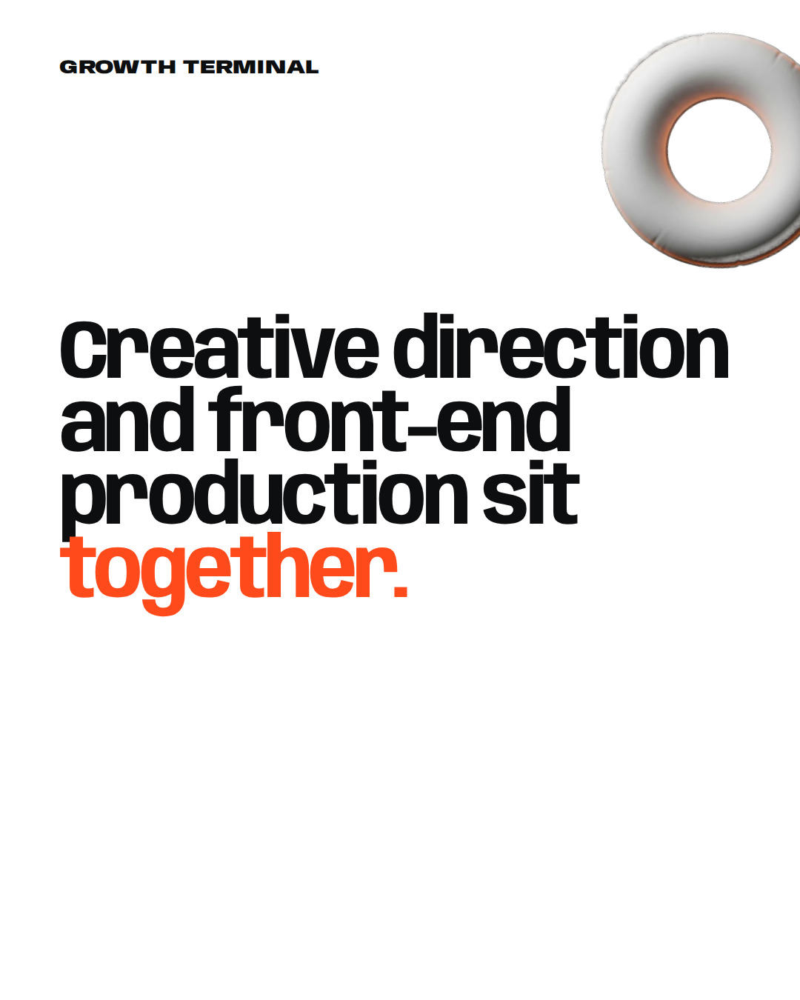

# Marketing Batch 02 — Creative Preview

## 25 — Walk the Experience

## 26 — Context to Construction

## 27 — Places Sell on Feel

## 28 — Studio Range

## 29 — Medium Follows Material

## 30 — Point of View, Not Template

